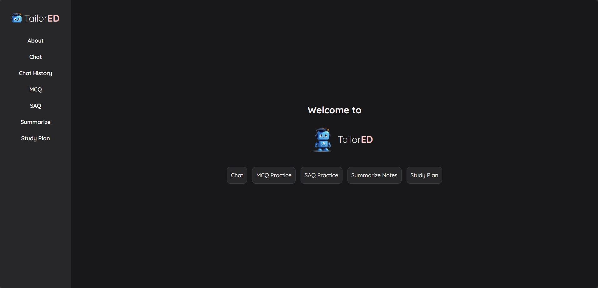

# TailorED

### Generative AI Powered Personalized Learning for University Students

Traditional education systems often employ a one-size-fits-all approach that fails to address the diverse learning needs of individual students. Adopting personalized education methods is crucial for ensuring the effective learning of university students by catering to their individual learning needs and bridging gaps in understanding. To this end, I present TailorED, an AI study companion that leverages generative AI models to provide a more effective and accessible personalized education experience for university students. TailorED consists of a context-aware chatbot, multiple-choice question (MCQ) practice tool, short-answer question (SAQ) practice tool, summarizer, and study plan generator that are designed to allow students to engage in self-directed learning and revision of course content more effectively. The AI assistant was evaluated on its effectiveness in enhancing the learning experience for university students. The evaluation results showed that the AI study companion was able to generate responses for the different tools with high accuracy and relevance with respect to the course material for university level education. This shows great potential for TailorED to enhance the personalized education experience for university students by acting as a 24/7 supplementary tool that can perpetually provide students with personalized learning support and feedback.

  
&nbsp; &nbsp; &nbsp; &nbsp;
  

  
&nbsp; &nbsp; &nbsp; &nbsp;
  

  
&nbsp; &nbsp; &nbsp; &nbsp;
  

### Quick start-up
1. `git clone https://github.com/wwaihoe/TailorED`
2. Add downloaded LLM ([Qwen/Qwen2.5-7B-Instruct-GGUF](https://huggingface.co/Qwen/Qwen2.5-7B-Instruct-GGUF)) into models folder.
3. `docker-compose --profile production up --build`  
